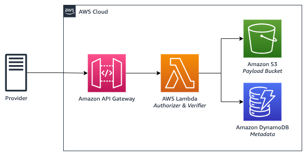
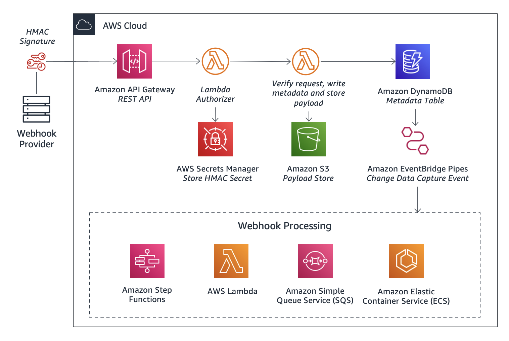

# Receiving Webhooks on AWS

An example event-driven application which receives webhooks using [serverless on AWS](https://aws.amazon.com/serverless/).

## How it works?

This repository contains an example application with an [Amazon API Gateway](https://aws.amazon.com/api-gateway/) that can be used to receive webhook requests from webhook providers. [AWS Lambda](https://aws.amazon.com/lambda/) is used to verify the requests before persisting the payload into [Amazon S3](https://aws.amazon.com/s3/). Metadata about the S3 object is then stored in [Amazon DynamoDB](https://aws.amazon.com/dynamodb/) for tracking webhook processing. 



## Using Amazon EventBridge Pipes to process webhooks

You can extend the solution using [Amazon EventBridge Pipes](https://docs.aws.amazon.com/eventbridge/latest/userguide/eb-pipes.html). The Pipe can be used to detect changes in the DynamoDB and trigger processing of the webhook using the compute option of your choice as illustrated below.



## Prerequisites

- [Python 3](https://www.python.org/downloads/)
- [AWS Command Line Interface (AWS CLI)](https://docs.aws.amazon.com/cli/latest/userguide/install-cliv2.html) version 2. Please follow these instructions with how to [setup your AWS credentials](https://docs.aws.amazon.com/serverless-application-model/latest/developerguide/serverless-getting-started-set-up-credentials.html).
- [AWS Serverless Application Model (SAM)](https://docs.aws.amazon.com/serverless-application-model/latest/developerguide/serverless-getting-started.html)
- [Docker Desktop](https://www.docker.com/products/docker-desktop)

## Usage

### Parameters

| Parameter            |  Type  |  Default  | Description                       |
| -------------------- | :----: | :-------: | --------------------------------- |
| BasicAuthUser        | String | -         | Basic authentication user name    |
| BasicAuthPassword    | String | -         | Basic authentication password     |
| WebhookSecret        | String | -         | Webhook secret                    |
| BucketPrefix         | String | raw/      | S3 bucket prefix for payloads     |

### Setup

1. Deploy the application using AWS SAM and follow the instructions.

```
sam deploy --guided
```

2. Test sending webhooks using the tool of your choice such as Postman or cURL, or use one of the pre-built providers on [/receive-webhooks/src/webhook/app/providers/](/src/webhook/app/providers/) such as Plaid or Stripe.

If you have a provider that you'd love to see, we'd love to [hear from you](https://github.com/aws-samples/webhooks/issues/new).

## Clean up

To avoid unnecessary costs, clean up after using the solution.

```
sam delete
```
