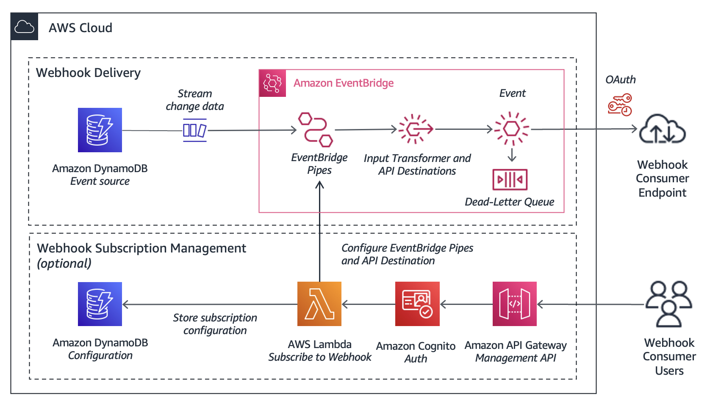

# Sending Webhooks on AWS

An example event-driven application which sends webhooks using [Amazon EventBridge Pipes](https://docs.aws.amazon.com/eventbridge/latest/userguide/eb-pipes.html).

## How it works?

The application takes the [change data capture event for DynamoDB streams](https://docs.aws.amazon.com/amazondynamodb/latest/developerguide/Streams.html) and uses [EventBridge Pipes](https://docs.aws.amazon.com/eventbridge/latest/userguide/eb-pipes.html) and [API destinations](https://docs.aws.amazon.com/eventbridge/latest/userguide/eb-api-destinations.html) to send the event to an external endpoint.



## Pre-Requisites

* [AWS SAM CLI](https://docs.aws.amazon.com/serverless-application-model/latest/developerguide/install-sam-cli.html)
* Python 3.10
* Optional: [evb-cli](https://github.com/mhlabs/evb-cli) for generating EventBridge patterns
* Optional: [eventbridge-transformer](https://eventbridge-transformer.vercel.app/)

## Setup

1. Deploy the application using AWS SAM 

```
sam deploy --guided
```

2. Once the application is deployed, you can test a status update by modifying the DynamoDB table. For example:

```
paymentId=$(date -u +"%Y%m%dT%H%M%S")
aws dynamodb put-item \
    --table-name PaymentStatusEvents \
    --item '{
        "paymentId": {"S": "'$paymentId'"},
        "status": {"S": "Paid"}
    }'
```

3. Test delivery of the webhook using the testing tool: [https://webhook.site/37e1931b-30c9-4d31-8336-8ec57b8be177](https://webhook.site/37e1931b-30c9-4d31-8336-8ec57b8be177)

### Notes

* For illustrative purposes only, we use `API_KEY` (instead of `OAUTH_CLIENT_CREDENTIALS`) as the `AuthorizationType` for the API Destinations [Connection](https://docs.aws.amazon.com/AWSCloudFormation/latest/UserGuide/aws-resource-events-connection.html). 

* The webhook subscription management application is currently **not** included in this repository. However, if you're interested in exploring a solution, please feel free to raise a Github issue.

* This repository is for illustrative purposes only. In production, ensure that you store any sensitive credentials securely, such as using AWS Secrets Manager.
